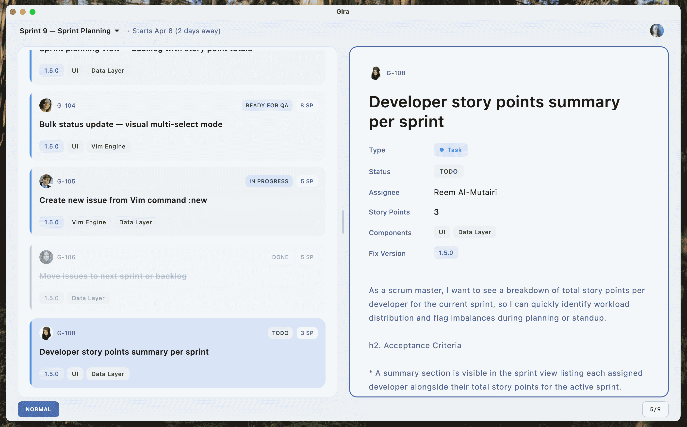

# Gira

> A fast, keyboard-first Jira client for developers who hate using the mouse.

---

## ⚡ Why Gira?

Jira is powerful… but painful.

- Slow and heavy UI  
- Too many clicks for simple actions  
- Breaks at the worst time (standups 👀)  
- Not built for keyboard-driven workflows  

**Gira fixes that.**

It’s a minimal, fast, keyboard-first interface designed for developers who want to move quickly.

---

## ✨ Key Features

- ⌨️ **Vim-style navigation**
- ⚡ **Blazing fast task browsing**
- 🔁 **Bulk & repeatable actions**
- 🧠 **Command-driven workflow**
- 🎯 **Minimal, distraction-free UI**
- 🔧 **Customizable keybindings**

---

## 📦 Download

> Currently available on **macOS** (more platforms coming soon)

### macOS

1. Download the latest `.dmg` from releases  
2. Open and drag to Applications  
3. Launch Gira  

👉 [Download latest version](../../releases/latest)

---

## 🚀 Quick Start

### 1. Generate Jira API Token

Go to your Atlassian account settings and create an API token.

You’ll need:
- Base URL (e.g. `https://your-domain.atlassian.net`)
- Email
- API Token

---

## ⌨️ Keybindings Cheatsheet

Navigation:
- `j`, `k` → Move between tasks  
- `gg`, `G` → Jump to top / bottom  

Focus:
- `Ctrl + h` / `Ctrl + l` → Switch panes  

Task actions:
- `mt` → Move to **To Do**
- `mp` → Move to **In Progress**
- `md` → Move to **Done**

Commands:
- `assign @user` → Assign task  
- `/filter @user` → Filter tasks  

…and more.

---

## 🛣️ Roadmap

### 🐞 Known Issues
- [ ] Task list focus inconsistencies  

### 🔮 Planned Features
- [ ] Markdown rendering for descriptions  
- [ ] Full task editing (title, description, fields)  
- [ ] Smart command suggestions & autocomplete  
- [ ] Advanced filtering  

---

## 🖥️ Platform Support

Planned:
- [ ] Windows  
- [ ] Linux  
- [ ] Android  
- [ ] iOS  

---

## 💬 Feedback

Found a bug? Have an idea?

Open an issue — feedback is highly appreciated.

---

## 🧠 Philosophy

Gira was built out of frustration.

After years working as a developer (and Scrum Master), I wanted a tool that:
- respects speed  
- prioritizes keyboard workflows  
- removes friction from daily work  

So I built it.

---

## ⭐ Support

If you find Gira useful:
- Star the repo ⭐  
- Share it with your team  
- Give feedback  

It helps a lot.
